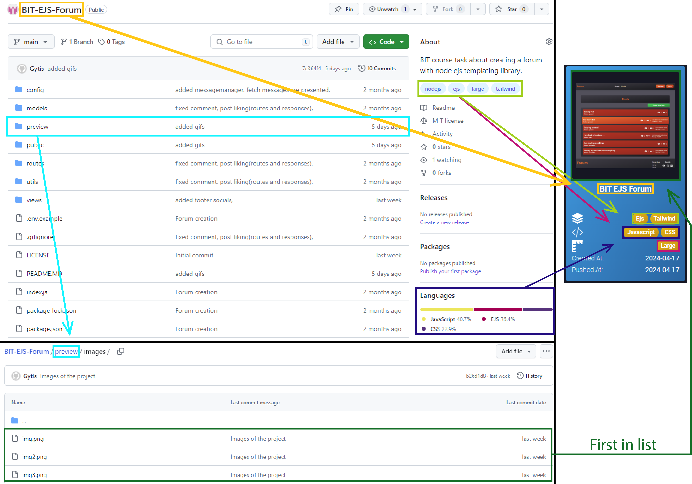
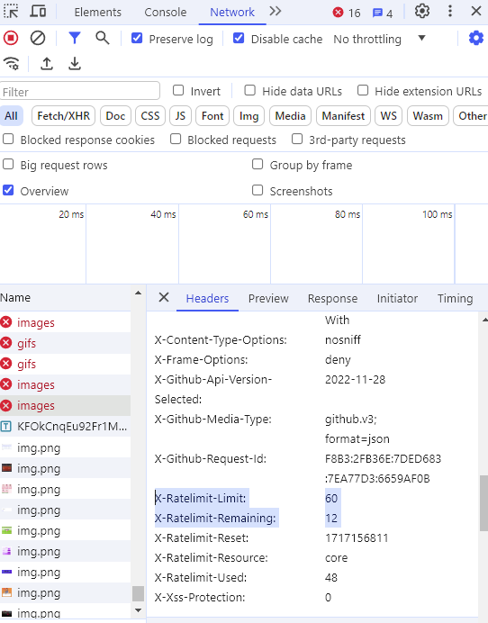

<h1 align="center">
    AutoHub Portfolio
</h1>
 

   
  
  

  

## Welcome!

### Description

AutoHub Portfolio(Automatic GitHub Portfolio) uses GitHub API to scrape your public repositories and present their data using conventions. You can always add additional projects, such as private repositories, manually. This project aims to create a quick portfolio without the need for a backend server, reducing expenses for new developers and serving as an example. For frontend contact form I used <a href="https://formspree.io/">formspree</a>.

Highly recommend using something like <a href="https://www.screentogif.com/">ScreenToGif</a> to create GIFs of the the project!

### Prerequisites

-   Node.js (v20.10.0 or later)
-   NPM or Yarn installed

### Conventions

Repositories cards are created following <a href="#card-conventions">these conventions</a>. Each color with arrow represents information flow.

  

Repositories pages follows mostly similiar information flow and includes description(if it exists).
All possible stack variantions can be found in <a href="./src/enums/FrameworksEnum.tsx">`src/enums/FrameworksEnum.tsx`</a>. It includes not only `frameworks`.
All possible languages variantions can be found in <a href="./src/enums/LanguagesEnum.tsx">`src/enums/LanguagesEnum.tsx`</a>. It includes not only `Programming` languages.
All possible sizes variantions can be found in <a href="./src/enums/ProjectSizesEnum.tsx">`src/enums/ProjectSizesEnum.tsx`</a>.

### Important information

GitHub API has <a target="_blank" href="https://docs.github.com/en/rest/using-the-rest-api/rate-limits-for-the-rest-api?apiVersion=2022-11-28#primary-rate-limit-for-unauthenticated-users">rate limits</a>. For not registered users maximum is <a href="#rate-limit">60 calls</a> per hour. AutoHub Portfolio uses <a href="./src/utils/api/FetchCacher.tsx">FetchCacher</a> to store fetched data and if limit is reached or error occurs it presents stored data instead.

-   **_ Version 0.0.1 contains some of my personal information that I do not mind sharing. The project was a bit rushed to be published, and in the following versions, the data will be minimized. _**

  

# Steps to launch this project

# 1. Add data for repositories

**[✔] 1.1 Add images/gifs to existing projects**

-   Create new `preview/images` folder and/or `preview/gifs` folder in existing repositories and fill them with content.

# 2. Setup project

**[✔] 2.1 Change GitHub User to scrape data from**

-   Locate `src/utils/api/githubAPI` and in class `GithubApi` change `static name = "Your GitHub User Name"`.

**[✔] 1.2 Install dependencies**

-   Run `npm install` in the root directory to install the required packages.

**[✔] 1.3 Build the project**

-   Use `npm run build` to build project.

# 3. Publish project

**[✔] 3.1 Put project in GitHub as a Repository**

-   Create public repository on GitHub and push code to it or initialize repository remotly through git.

**[✔] 3.2 Make GitHub page**

-   Make GitHub page. Recommend <a target="_blank" href="https://www.youtube.com/watch?v=XhoWXhyuW_I">this tutorial</a> for people who do not know how to deploy Vite React App.

## Used assets

-   Project uses [unsplash(MIT)](https://unsplash.com/license).

### Unsplash authors

-   [Pankaj Patel](https://unsplash.com/@pankajpatel)
-   [Billy Huynh](https://unsplash.com/@billy_huy)
